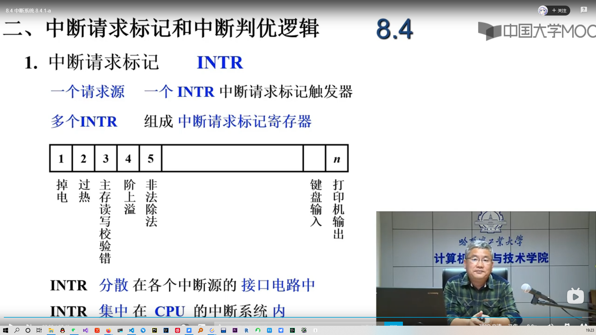
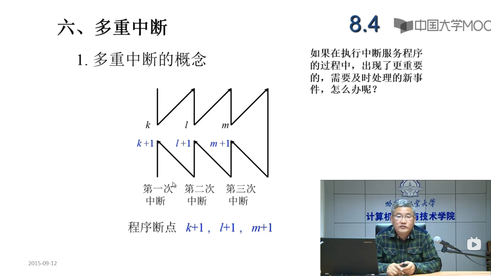
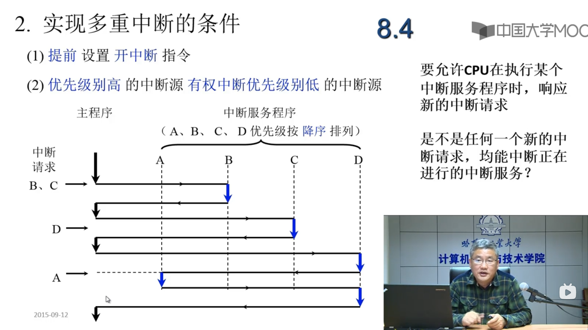
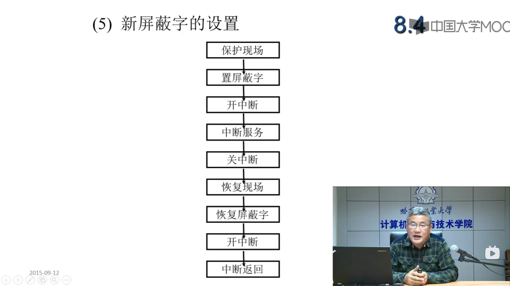

##### 引起中断的原因
* 认为设置的中断，如 专管指令
* 程序性事故 溢出、操作码不能识别，除法非法
* 硬件故障
* I/O设备
* 外部事件 用键盘中断程序
* 
##### 中断系统需要解决的问题
* 各种断源**如何**向CPU提出清楚？
* CPU断源**同时**提出**请求**怎么办？
* CPU什么条件，什么时间，以什么样的方式响应中断？
* 如何保护现场？
* 如何寻找入口地址？
* 如何恢复现场，如何返回？
* 处理中断的过程中又出现新的中断怎么办？
* 

### 实现的方式就是硬件+软件

如果有多个中断请求，应该怎么办？应该优先响应那个请求？
1. 硬件实现(排队器)
    1. 分散在各个中断源的接口电路中 链式排队器
    2. 集中在CPU内部
2. 软件实现(程序查询方式)，中断源按照优先级排队，然后程序挨个儿查询是否有提出中断请求。比如，有三个中断源A,B,C，中断优先级依次降低，先查询A是否有中断请求，如果没有，再查询B是否有中断请求，如果有那么转入B的中断服务程序的入口地址。

### 中断服务程序的入口地址的寻找
1. 硬件向量法
2. 软件查询的方法

## 中断响应
1. 响应中断的条件，CPU中有一个允许中断触发器 EINT,只有当EINT==1时，CPU才会响应中断请求
2. 响应中断的时间
一般情况下，响应中断只有在指令结束后，但是有些计算机考虑到某些指令的执行时间比较长时为了及时的处理一些中断请求，允许在指令执行期间响应中断

指令执行周期结束时刻由CPU发查寻信号，这个查询信号送到每个中断源中的中断触发器,查询信号会驱动中断请求触发器，将触发器的输出端置为1，然后把中断请求信号送到排队电路

## 中断隐指令
 中断系统还需要解决程序断点的保存，需要生成中断服务程序的入口地址。另外，对于单重中断CPU来说，不允许有新的中断打断CPU正在执行的中断服务程序。即使在多重中断的CPU中，也不允许优先级低的中断源打断正在执行的优先级高的中断源的中断服务程序。

**中断响应过程中需要解决几个问题**  
下面的三个操作都是由计算机的硬件来完成的，并不是在某个具体指令的驱动下完成的，中断隐指令并不是计算机指令集中的一条指令
* 保护程序断点
    * 断点存于特定地址(内存的X地址)内
    * 断点进栈，返回时断点出栈
* 寻找服务程序入口地址
    * *向量地址——>PC*(硬件向量法)：把中断向量地址送到PC中，PC中保存的是向量地址，这个向量中包含了中断服务程序的入口地址(或者是一条跳转指令，这个指令会跳转道中断服务的入口地址)
    * 中断识别程序 入口地址M——>PC(软件查询法)：也就是把中断识别程序的入口地址M送到PC中，去执行这个中断识别程序，以找到中断服务程序的入口地址

* 关中断：目的是为了防止在单重中断的机器中，当CPU正在处理中断服务程序时，会有新的中断亲求打断。在多重中断机器中，关中断也是为了保存程序断点，保存CPU现场的一个过程。**关中断其实就是把中断触发器INT置为0**

## 保护现场和恢复现场
1. 保护现场
    * 断点——中断隐指令来完成
    * CPU中的寄存器内容——由中断服务程序完成
2. 恢复现场——由中断服务程序来完成
3. 中断服务程序
    * 保护现场 Push
    * 其他服务程序 视不同的请求源而定
    * 恢复现场 POP
    * 中断返回 IRET

  

中断的服务程序的完整过程：
1. 保护现场
2. 置屏蔽字
3. 开中断，目的是为了实现多重中断
4. 中断服务
5. 关中断，恢复现场之前要关中断，恢复现场，保存现场，设置屏蔽字和恢复屏蔽字的过程的过程不能被打断，所以需要关中断
6. 恢复现场
7. 恢复屏蔽字
8. 开中断
9. 中断返回

 
