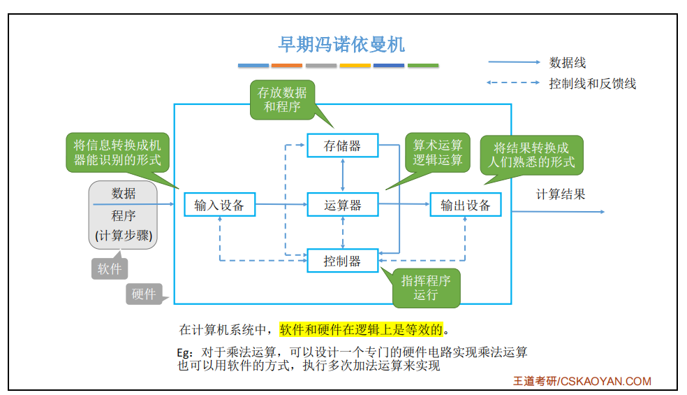
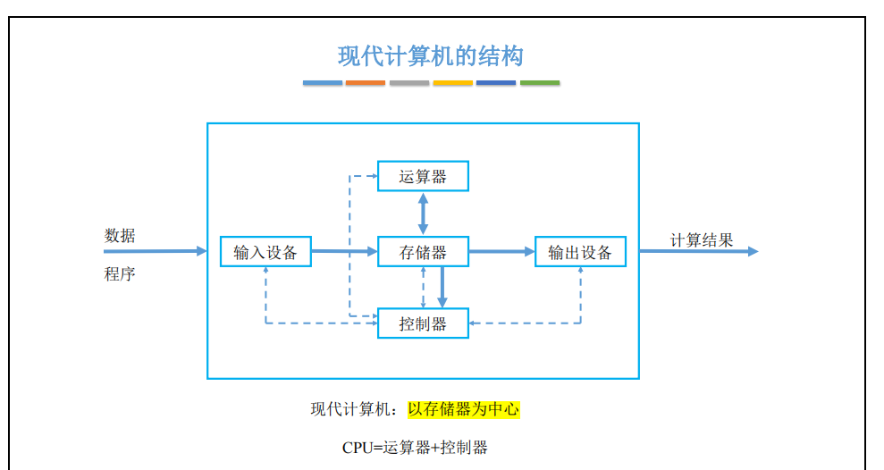
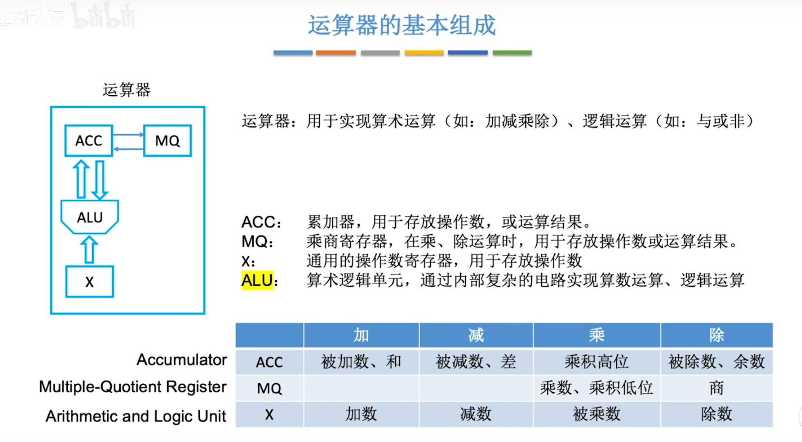
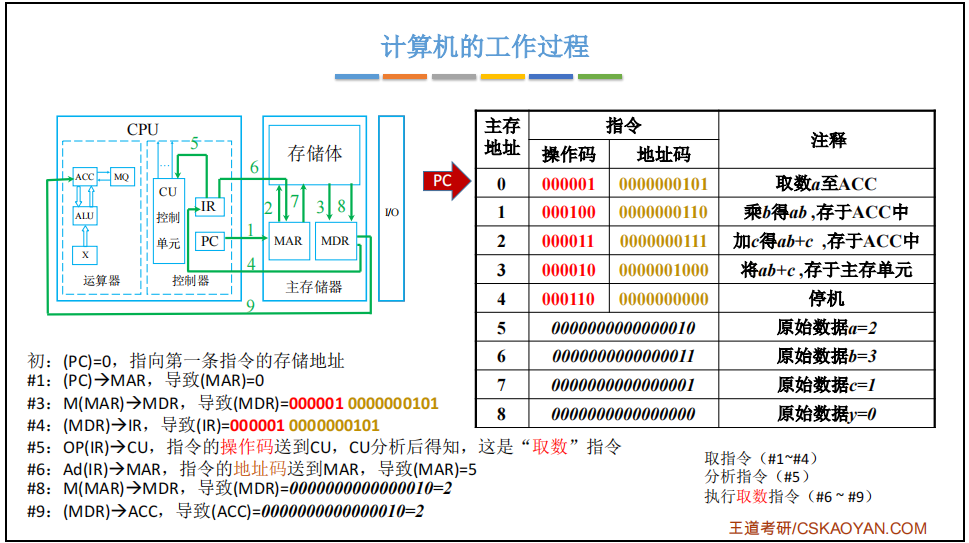
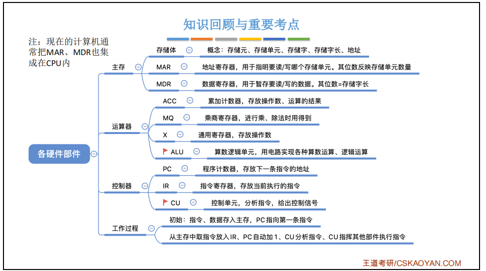

# 计算机组成原理知识点整理

## 第一章 计算机系统概述
### 计算机的发展历程
* 第一代计算机——电子管时代
* 第二代计算机——晶体管时代
* 第三代计算机——中小规模集成电路
* 第四代计算机——超大规模集成电路

计算机元件的更新换代
1. 摩尔定律
2. 半导体存储器的发展
3. 微处理器的发展

### 计算机的发展方向
* 电子计算机
* 模拟计算机

计算机按照指令和数据流可以分为下面的分类：
* 单指令流和单数据流(singl instruction single data,SISD)，即冯诺依曼体系结构
* 单指令流和多数据流(single instruction multiple data,SIMD)，包括阵列处理器和向量处理器系统
* 多指令流和多数据流(multiple instruction multiple data,MIMD)，包括多处理器和多计算机系统
* 多指令流和单数据流(multiple instruction single data)，这种计算机不存在

### 计算机硬件的基本组成
**早期的冯诺依曼计算机**
冯诺依曼计算机的硬件系统有：运算器，存储器，控制器，输入设备，输出设备组成。如下图：

冯诺依曼计算机有下面的特点：
* 指令和数据以同等地位存储在存储器中，并可按地址寻访
* 指令和数据均用二进制代码表示
* 指令由操作码和地址码组成，操作码用来表示操作的性质，地址码用来表示操作数在存储器中的位置
* 指令在存储器内按顺序存放。通常，指令是顺序执行的，在特定条件下可以根据运算结果或根据设定的条件改变执行顺序
* 早期的冯诺依曼计算机以运算器为中心，输入/输出设备通常运算器与存储器传送数据。

注意：
"存储程序"的概念是将指令以代码的形式事先输入到计算机的主存储器，然后再按其再存储器中的首地址执行程序的第一条指令，以后就按该程序的规定顺序执行其他指令，直至程序结束。

#### 现代计算机的组织结构
因为很多IO操作根本不需要处理器的参与，所以现代计算机以存储器为中心设计，结构如下：

#### 计算机的功能部件
* 输入设备
* 输出设备
* 存储器
  存储器分为主存储器和辅存储器。主存储器由许多个存储单元组成，每个存储单元包含多干个存储元件，每个元件存储一位二进制代码"0"或"1"。因此存储单元可以存储一串二进制代码，这个串称为存储字，称这个串代码的位数为存储字长，存储字长可以是1B，或者是字节的整数倍
**MDR位数等于存储字长**
**MAR位数反映存储单元的个数，MAR长度也和PC的长度相等**

* 运算器
用于计算加减乘除，和逻辑运算

* 控制器
    * 程序计数器(PC,prgram counter)
    * 指令寄存器(IR,instruction register)
    * 控制单元(CU,control unit)

#### 计算机的工作过程
1. 把程序和数据装入存储器
2. 把源程序转换成可执行文件
3. 从可执行文件的首地址开始逐条执行指令

**************

## 第二章 数据的的表示和运算

## 第三章 存出系统

## 第四章 指令系统

## 第五章 中央处理器

## 第六章 总线

## 第七章 输入/输出系统

